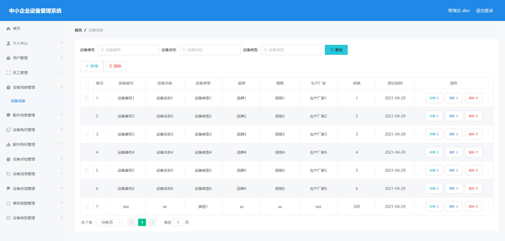
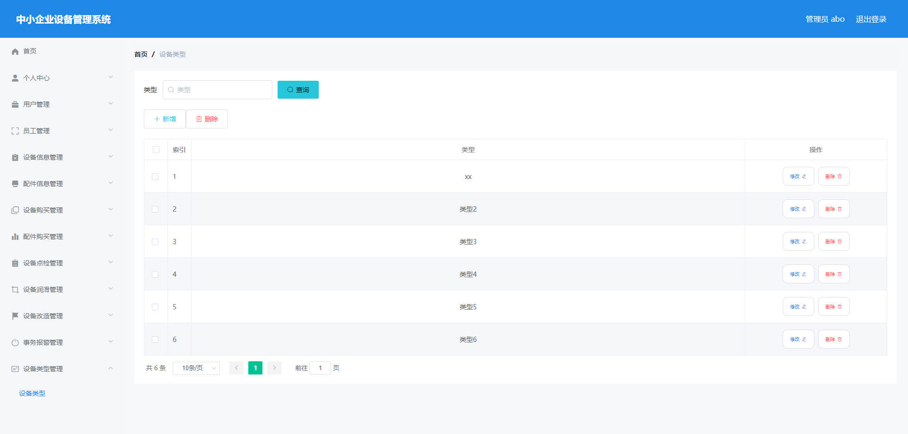

# 基于Springboot的中小企业设备管理系统

## Springboot-0090


## 技术栈

Springboot mybatisplus vue mysql maven


## 数据库表(18张)


## 功能介绍

```properties
系统管理员有个人中心，用户管理，员工管理，设备信息管理，配件信息管理，设备购买管理，配件购买管理，设备点检管理，设备润滑管理，设备改造管理，事务报警管理，设备类型管理。

员工有个人中心，设备信息管理，设备购买管理，设备报修管理，售后检修管理，售后保养管理，设备安装管理，设备点检管理，设备润滑管理，设备改造管理，事务报警管理。
```


## 图片

### 前台

### 后台








## 访问路径

### 前台

```properties

```

### 后台

```properties
http://localhost:8080/springbootu6123/admin/dist/index.html#/login

账号 abo
密码 abo
```


## 功能图


## 文档目录


## 打赏或交流


